# 概述

新版窗口系统方案

# 类设计

```javascript
abstract class BaseWindow {
    uuid;
}

class WindowDragHandler;
class WindowResizer;
class WindowContentMenu;
```

```javascript
class SimpleWindow extends BaseWindow{
    private string _name;
    titlebar;
    htmlContent;
}
```

```javascript
class TabContainer extends BaseWindow {
    
}
```

```javascript
type SplitDirection = 'horizontal' | 'vertical';

class SplitContainer extends BaseWindow {
    direction: SplitDirection; // 'horizontal' for left-right, 'vertical' for top-bottom
    children: string[]; // Array of child node IDs
    ratios: number[]; // Array of ratios, length is children.length - 1
    // Each ratio represents cumulative ratio up to that divider
}
```

一个BaseWindow就是一个Window树，每一个树节点可能是SimpleWindow、TabContainer、SplitContainer：
+ `SimpleWindow`只能作为叶子节点, 有实际内容
    - 只有`SimpleWindow`拥有name。
    - `SimpleWindow`的titlebar并不是全占满。而是以“tab”的样式显示一个html元素

+ `TabContainer`是容器，没有实际内容，只能容纳`SimpleWindow`; 
    - `TabContainer`的titleBar以tab的方式显示其中容纳的SimpleWindow的name，可以容纳多个tab，点击tab可以切换到不同的SimpleWindow
    - Tab之间通过拖拽改变排列方式，需要丝滑的挤压动画

+ `SplitContainer`是容器，没有实际内容，可以容纳`SplitContainer`、`SimpleWindow`和`TabContainer`，允许上下 divide 和左右 divide；
    - `SplitContainer`支持多个子节点（children[]），通过 direction 区分水平（horizontal）或垂直（vertical）排列
    - 每个分割条对应一个比例值（ratios[]），长度为 children.length - 1
    - 节点提升机制：当目标容器的 direction 等于父容器的 direction 时，新节点直接加入父容器的 children，成为目标容器的兄弟节点

## 基础操作

+ 所有BaseWindow分为浮动和吸附状态
+ 浮动的时候可以随意resize、移动，当然resize有最小限制，最大也会被限制在workspace内部
+ 吸附的时候会有三边和其他Window或者workspace边缘接触，这时只有一边是可以活动resize的
+ 可以通过拖拽将吸附态转为浮动态


## 拖拽操作

+ 只有Tab这个html元素允许被拖拽，且同时只能拖拽单个

### 窗口 merge / stack / divide

命名约定：

- `merge`：指浮动窗口重新回到布局树的过程，可能最终形成 `stack` 或 `divide`。
- `stack`：指合并进目标 `TabContainer`。
- `divide`：指创建或扩展 `SplitContainer`。
- `detach`：指从容器中剥离，重新变成浮动窗口。

具体交互：

- 两个 `TabContainer`：拖拽其中一个的 tab 到另一个 `TabContainer` 的 titlebar 上，展示 `stack` 预览，释放后将源容器中的 `SimpleWindow` stack 到目标 `TabContainer`，源 `TabContainer` 销毁。
- 两个 `SimpleWindow`：拖拽其中一个的 header 到另一个 header 附近，展示 `stack` 预览，释放后创建新的 `TabContainer`，两个窗口以 tab 形式 stack。
- `SimpleWindow` → `TabContainer`：拖拽 `SimpleWindow` 的 header 到目标 titlebar，展示 `stack` 预览，释放后直接 stack。
- `TabContainer` → `SimpleWindow`：不触发 stack。

- `TabContainer` 之间进行 divide：拖拽 tab 到目标内容区域的边缘，展示 `divide` 预览，释放后创建新的 `SplitContainer` 或加入父容器（节点提升）。
  - 拖拽到叶子容器边缘 20% 区域（左、右、下边缘）：触发该容器的 split
  - 拖拽到父容器边缘 10% 区域（左、右、下边缘）：将节点加入父容器（节点提升机制）
  - 拖拽到上边缘：不触发任何操作（无论是叶子容器还是父容器）
  - 拖拽到左右边缘：触发水平 split（horizontal）
  - 拖拽到下边缘：触发垂直 split（vertical）
- 空 workspace docking：当 docking 工作区为空（`rootId === null`）时，拖动 floating 容器到 workspace 区域会显示覆盖整个 workspace 的预览，释放后将 floating 窗口设置为 docking 根节点。
- 两个 `SimpleWindow` 触发 divide：先将双方分别 stack 进新的 `TabContainer`，再执行 divide 逻辑。
- `TabContainer` 与 `SimpleWindow` divide：为 `SimpleWindow` 创建临时 `TabContainer` 后执行 divide。
- 节点提升机制：当目标容器的 direction 等于父容器的 direction 时，新节点直接加入父容器的 children，成为目标容器的兄弟节点，而不是创建新的 SplitContainer。

- `SimpleWindow` 可以从 `TabContainer` 或 `SplitContainer` detach，detach 后转为浮动状态。

### workspace填充
workspace是一块固定大小的区域，只要我们不resize浏览器。把所有tab都脱离才允许workspace空白，否则按照 divide 规则填满workspace。

### 吸附到workspace边缘
有了workspace填充和 divide，不再需要吸附到边缘了


## 当前实现说明

### 基础结构

- Workspace 始终维护一棵窗口树（`WindowTreeStore`），根节点可以是 `TabContainer` 或 `SplitContainer`，所有 `SimpleWindow` 都以 Tab 形式展示（包装在 `TabContainer` 中）。
- `WindowDomRenderer` 将窗口树渲染到 `.pale-window-root-layer`，同时维护 `.pale-window-floating-layer` 用于显示浮动窗口。
- 每个浮动窗口都会携带完整的子树（通常是一个 TabContainer），结构与固定窗口保持一致。

### 初始布局

`worldUI` 的初始布局结构如下：

```
Root (horizontal SplitContainer)
├── hierarchyPanel (TabContainer) - 20%
├── middle (vertical SplitContainer) - 60%
│   ├── viewport (TabContainer) - 80%
│   └── profilerPanel (TabContainer) - 20%
└── InspectorPanel (TabContainer) - 20%
```

- 根节点是一个水平的 `SplitContainer`，包含三个子节点
- 左侧是 `hierarchyPanel`，占 20% 宽度
- 中间是垂直的 `SplitContainer`（middle），包含 `viewport` 和 `profilerPanel`，占 60% 宽度
  - `viewport` 占 middle 的 80% 高度
  - `profilerPanel` 占 middle 的 20% 高度
- 右侧是 `InspectorPanel`，占 20% 宽度

### 交互体系

- 统一依赖 `InputContext` / `LocalInputManager` / `GlobalInputManager`。
- Tab 点击或拖拽、Split 分割条、浮动窗口的拖拽与缩放都通过 `WindowInteractionManager` 管理。
- 聚焦逻辑：点击 / 拖拽 / 缩放任意浮动窗口都会调用 `WindowTreeStore.bringFloatingToFront`，刷新 z-index 并重绘，使其显示在最上层。

### 浮动逻辑

- 拖拽 Tab 离开 TabBar、或 SimpleWindow Header 离开 Workspace 时会触发 `floatSimpleWindow`：
  - 简单窗口从树中拆离，并包装进独立 `TabContainer`，确保 Tab 风格标题不变。
  - 生成 `FloatingWindowDescriptor`，持久化位置、尺寸、z-index 等信息。
  - 浮动窗口渲染后附带 8 向 resize hande，支持绝对定位拖拽与缩放，自动限制在 Workspace 内。
- 浮动窗口拖拽过程中重新查询当前 DOM 节点，使得 z-index 更新触发的重绘不会中断操作。
- Tab 拖拽与浮动 TabBar 拖拽都会在 `bringFloatingToFront` 后重新获取 `.pale-window-floating` 节点，确保拖拽过程中总是绑定最新 DOM，避免因重新渲染造成的滞后。

### 浮动 / Docking 分层与数据流

- 渲染层分为两部分：
  - `.pale-window-root-layer`：用于渲染当前窗口树的根节点（`TabContainer`/`SplitContainer`），所有吸附窗口都会挂在这里。
  - `.pale-window-floating-layer`：用于渲染 `floatingRootsMap` 中登记的浮动子树，窗口以 `.pale-window-floating` 包裹并承载 resize handle。
- `WindowTreeStore` 维护一份 `floatingRootsMap`（key 为浮动子树的根节点 id），以及 `floatingNodeIndex`（SimpleWindow → 根 id）组成的 “floating forest”。每条 `FloatingWindowDescriptor` 记录根 id、当前激活的 `activeNodeId`、位置、尺寸、z-index 等信息。
- 浮动 tab 再次 detach 时，会为该 tab 包装新的独立 `TabContainer` 并生成新的根记录，同时刷新旧根的索引，保证剩余 tab 仍然通过原 root 渲染。
- `WindowDomRenderer.renderFloatingWindows()` 遍历 `floatingRootsMap`，按根节点渲染完整子树并设置 transform / size / z-index，使浮动层与吸附层保持解耦。
- 浮动状态下，拖拽 `TabContainer` 的 tabbar 空白区域（非具体 tab 按钮）可以移动整个容器，方便在多 tab 布局中快速 reposition。
- 当浮动 `SplitContainer` 中拆出子节点导致只剩单子时，会将剩余子树通过 `reassignFloatingRoot` 升为新浮动根，避免误写 `rootId` 影响 docking 层。

### 交互分工与核心流程

- `WindowInteractionManager` 在鼠标按下时建立拖拽 session，并将事件分派到三套交互器：
  - `WindowInteractionDocking`：负责吸附态容器间的 stack/divide、tab 重排等操作。
  - `FloatingInteraction`：负责浮动窗口移动、缩放、tab 重排以及从浮动拖回布局树时的 docking 预览。
  - `WindowInteractionShared`：抽象了输入事件的共用接口与合成事件。
- 浮动窗口拖动流程：
  1. `FloatingInteraction.beginFloatingWindowDrag` 记录初始位置，进入 `DragSession`。
  2. `handleFloatingMove` 更新临时 descriptor 并驱动 docking 预览（`updateFloatingDockingPreview`）。
  3. 鼠标释放时调用 `stopFloatingDrag`，若未 dock 则通过 `store.setFloatingWindow` 落地最新位置；若 dock 成功则交给 `WindowInteractionDocking` 完成树结构调整。
- 浮动 tab detach 流程：
  1. `handleFloatingTabMove` 判断指针是否离开 tabbar；一旦离开即 `detachFloatingTab`。
  2. `WindowTreeStore.detachSimpleWindow` 将当前 tab 从容器中拆出、包装为独立 `TabContainer`，写入新的浮动根节点，并刷新旧根在 `floatingNodeIndex` 中的成员。
  3. 通过 `host.beginFloatingDragFromTab` 在同一拖拽手势内切换为浮动窗口拖拽，旧浮动容器在 forest 中仍拥有独立根节点，剩余 tab 不会被销毁。
- Docking/Stack 流程：
  1. `WindowInteractionDocking` 根据指针位置计算 `DockingScope`，显示 `DockingPreview` 或 divide overlay。
  2. 释放鼠标时调用 `store.moveSimpleToTab` 或 `store.divideSimpleWithExisting` 等 API，直接修改窗口树结构。
  3. 结构变更通过 `tree-changed` 事件触发重新渲染，同时会根据需要调用 `reassignFloatingRoot` 确保浮动窗口的子树引用保持一致。

### DOM 元素结构

窗口系统的 DOM 结构分为两层：**Docking 层**（吸附窗口）和 **Floating 层**（浮动窗口）。

#### Workspace 容器结构

```
.pale-window-workspace (host container)
├── .pale-window-root-layer (docking层，相对定位，flex布局)
│   └── [窗口树根节点: TabContainer 或 SplitContainer]
└── .pale-window-floating-layer (floating层，绝对定位，pointer-events: none)
    └── [多个浮动窗口]
```

#### TabContainer 结构（Docking）

```
.pale-window-tabContainer[data-node-id="..."]
├── .pale-window-tabbar
│   ├── .pale-window-tab[data-tab-id="..."][data-active="true|false"] (button)
│   ├── .pale-window-tab[data-tab-id="..."][data-active="true|false"] (button)
│   └── ... (更多 tab)
└── .pale-window-tabcontainer__content
    └── .pale-window-simple[data-node-id="..."] (active child)
        ├── .pale-window-simple__header[data-node-id="..."] (可选，非headless时存在)
        └── .pale-window-simple__content
            └── [BaseWindow.mount(content) 挂载的内容]
```

#### SplitContainer 结构（Docking）

```
.pale-window-split[data-node-id="..."]
├── .pale-window-split--horizontal 或 .pale-window-split--vertical
├── .pale-window-split__pane[data-pane="first"][data-pane-index="0"]
│   └── [子节点: TabContainer 或 SimpleWindow]
├── .pale-window-split__divider[data-direction="horizontal|vertical"][data-split-id="..."][data-divider-index="0"]
├── .pale-window-split__pane[data-pane="pane-1"][data-pane-index="1"]
│   └── [子节点: TabContainer 或 SimpleWindow]
├── .pale-window-split__divider[data-direction="horizontal|vertical"][data-split-id="..."][data-divider-index="1"]
├── ... (更多 pane 和 divider)
└── .pale-window-split__pane[data-pane-index="N"]
    └── [子节点: TabContainer 或 SimpleWindow]
```

注意：SplitContainer 支持多个子节点，每个子节点之间有一个 divider。divider 的索引从 0 开始，对应 ratios 数组中的索引。

#### Floating Window 结构

```
.pale-window-floating[data-node-id="rootId"]
├── style: transform, width, height, zIndex (动态设置)
├── .pale-window-floating__content
│   └── [完整的子树，通常是 TabContainer，也可能是 SplitContainer]
│       └── [结构与 Docking 层中的相同]
├── .pale-window-floating__resize.pale-window-floating__resize--n[data-floating-handle="n"]
├── .pale-window-floating__resize.pale-window-floating__resize--s[data-floating-handle="s"]
├── .pale-window-floating__resize.pale-window-floating__resize--e[data-floating-handle="e"]
├── .pale-window-floating__resize.pale-window-floating__resize--w[data-floating-handle="w"]
├── .pale-window-floating__resize.pale-window-floating__resize--ne[data-floating-handle="ne"]
├── .pale-window-floating__resize.pale-window-floating__resize--nw[data-floating-handle="nw"]
├── .pale-window-floating__resize.pale-window-floating__resize--se[data-floating-handle="se"]
└── .pale-window-floating__resize.pale-window-floating__resize--sw[data-floating-handle="sw"]
```

#### SimpleWindow 结构（独立或嵌套）

```
.pale-window-simple[data-node-id="..."]
├── .pale-window-simple--headless (可选，headless模式)
├── .pale-window-simple__header[data-node-id="..."][data-active="true"] (可选，非headless时存在)
└── .pale-window-simple__content
    └── [BaseWindow.mount(content) 挂载的内容]
```

#### 完整示例：浮动 TabContainer

```
.pale-window-floating[data-node-id="root-123"]
├── style: transform: translate(100px, 200px); width: 400px; height: 300px; z-index: 1001
├── .pale-window-floating__content
│   └── .pale-window-tabContainer[data-node-id="tab-456"]
│       ├── .pale-window-tabbar
│       │   ├── .pale-window-tab[data-tab-id="simple-1"][data-active="true"]
│       │   └── .pale-window-tab[data-tab-id="simple-2"][data-active="false"]
│       └── .pale-window-tabcontainer__content
│           └── .pale-window-simple[data-node-id="simple-1"]
│               ├── .pale-window-simple__header[data-node-id="simple-1"]
│               └── .pale-window-simple__content
│                   └── [窗口内容]
├── .pale-window-floating__resize--n
├── .pale-window-floating__resize--s
├── .pale-window-floating__resize--e
├── .pale-window-floating__resize--w
├── .pale-window-floating__resize--ne
├── .pale-window-floating__resize--nw
├── .pale-window-floating__resize--se
└── .pale-window-floating__resize--sw
```

#### Mermaid 结构图

```mermaid
graph TD
    Workspace[".pale-window-workspace<br/>(host container)"] --> RootLayer[".pale-window-root-layer<br/>(docking层)"]
    Workspace --> FloatingLayer[".pale-window-floating-layer<br/>(floating层)"]
    
    RootLayer --> TabContainer[".pale-window-tabContainer"]
    RootLayer --> SplitContainer[".pale-window-split"]
    
    TabContainer --> Tabbar[".pale-window-tabbar"]
    TabContainer --> TabContent[".pale-window-tabcontainer__content"]
    
    Tabbar --> Tab1[".pale-window-tab<br/>(button)"]
    Tabbar --> Tab2[".pale-window-tab<br/>(button)"]
    
    TabContent --> Simple[".pale-window-simple"]
    Simple --> Header[".pale-window-simple__header"]
    Simple --> SimpleContent[".pale-window-simple__content"]
    
    SplitContainer --> Pane1[".pale-window-split__pane<br/>(first)"]
    SplitContainer --> Divider[".pale-window-split__divider"]
    SplitContainer --> Pane2[".pale-window-split__pane<br/>(second)"]
    
    Pane1 --> Child1[TabContainer 或 SimpleWindow]
    Pane2 --> Child2[TabContainer 或 SimpleWindow]
    
    FloatingLayer --> Floating[".pale-window-floating"]
    Floating --> FloatingContent[".pale-window-floating__content"]
    Floating --> ResizeN[".pale-window-floating__resize--n"]
    Floating --> ResizeS[".pale-window-floating__resize--s"]
    Floating --> ResizeE[".pale-window-floating__resize--e"]
    Floating --> ResizeW[".pale-window-floating__resize--w"]
    Floating --> ResizeNE[".pale-window-floating__resize--ne"]
    Floating --> ResizeNW[".pale-window-floating__resize--nw"]
    Floating --> ResizeSE[".pale-window-floating__resize--se"]
    Floating --> ResizeSW[".pale-window-floating__resize--sw"]
    
    FloatingContent --> FloatingSubtree[完整的子树<br/>TabContainer 或 SplitContainer]
    
    style Workspace fill:#e1f5ff
    style RootLayer fill:#c8e6c9
    style FloatingLayer fill:#fff3e0
    style TabContainer fill:#f3e5f5
    style SplitContainer fill:#f3e5f5
    style Floating fill:#ffcdd2
```

#### 字符画结构图（详细版）

**Workspace 整体布局：**

```
┌─────────────────────────────────────────────────────────┐
│ .pale-window-workspace                                    │
│                                                           │
│  ┌────────────────────────────────────────────────────┐ │
│  │ .pale-window-root-layer (docking层)                │ │
│  │                                                      │ │
│  │  ┌──────────────────────────────────────────────┐  │ │
│  │  │ TabContainer / SplitContainer (根节点)       │  │ │
│  │  └──────────────────────────────────────────────┘  │ │
│  └────────────────────────────────────────────────────┘ │
│                                                           │
│  ┌────────────────────────────────────────────────────┐ │
│  │ .pale-window-floating-layer (floating层)          │ │
│  │  pointer-events: none                               │ │
│  │                                                      │ │
│  │  ┌──────────────┐  ┌──────────────┐               │ │
│  │  │ .floating    │  │ .floating    │  (多个浮动)   │ │
│  │  │ (窗口1)      │  │ (窗口2)      │               │ │
│  │  └──────────────┘  └──────────────┘               │ │
│  └────────────────────────────────────────────────────┘ │
└─────────────────────────────────────────────────────────┘
```

**TabContainer 详细结构（Docking）：**

```
┌─────────────────────────────────────────────────────────┐
│ .pale-window-tabContainer[data-node-id="tab-123"]      │
├─────────────────────────────────────────────────────────┤
│ .pale-window-tabbar                                      │
│ ┌──────┐ ┌──────┐ ┌──────┐                              │
│ │ Tab1 │ │ Tab2 │ │ Tab3 │  (.pale-window-tab buttons) │
│ └──────┘ └──────┘ └──────┘                              │
├─────────────────────────────────────────────────────────┤
│ .pale-window-tabcontainer__content                      │
│ ┌─────────────────────────────────────────────────────┐ │
│ │ .pale-window-simple[data-node-id="simple-1"]       │ │
│ │ ┌─────────────────────────────────────────────────┐ │ │
│ │ │ .pale-window-simple__header                     │ │ │
│ │ │ "Window Title"                                  │ │ │
│ │ └─────────────────────────────────────────────────┘ │ │
│ │ ┌─────────────────────────────────────────────────┐ │ │
│ │ │ .pale-window-simple__content                    │ │ │
│ │ │ [BaseWindow.mount() 挂载的内容]                  │ │ │
│ │ └─────────────────────────────────────────────────┘ │ │
│ └─────────────────────────────────────────────────────┘ │
└─────────────────────────────────────────────────────────┘
```

**SplitContainer 详细结构（水平分割）：**

```
┌─────────────────────────────────────────────────────────┐
│ .pale-window-split.pale-window-split--horizontal        │
│ [data-node-id="split-456"]                              │
├──────────────┬──────────────────────────────────────────┤
│              │                                          │
│ .pale-window │ .pale-window-split__divider              │
│ -split__pane │ (可拖拽的分割条)                         │
│ [first]      │                                          │
│              │                                          │
│ ┌──────────┐ │ ┌────────────────────────────────────┐  │
│ │ TabCont  │ │ │ .pale-window-split__pane [second] │  │
│ │ 或       │ │ │                                    │  │
│ │ Simple   │ │ │ ┌──────────────────────────────┐ │  │
│ └──────────┘ │ │ │ TabContainer 或 SimpleWindow │ │  │
│              │ │ └──────────────────────────────┘ │  │
│              │ └────────────────────────────────────┘  │
└──────────────┴──────────────────────────────────────────┘
```

**Floating Window 详细结构：**

```
┌─────────────────────────────────────────────────────────┐
│ .pale-window-floating[data-node-id="root-789"]         │
│ style: transform: translate(x, y); width; height;      │
│        z-index: 1001                                    │
│                                                         │
│  ┌─ n ────────────────────────────────────────────┐   │
│  │ .pale-window-floating__resize--n               │   │
│  ├─────────────────────────────────────────────────┤   │
│ w│                                                 │ e │
│  │ .pale-window-floating__content                 │   │
│  │ ┌─────────────────────────────────────────────┐│   │
│  │ │ TabContainer 或 SplitContainer (完整子树)   ││   │
│  │ │ (结构与 Docking 层相同)                     ││   │
│  │ └─────────────────────────────────────────────┘│   │
│  │                                                 │   │
│  ├─────────────────────────────────────────────────┤   │
│  │ .pale-window-floating__resize--s               │   │
│  └─────────────────────────────────────────────────┘   │
│                                                         │
│  8个方向的 resize handles:                              │
│  n, s, e, w, ne, nw, se, sw                            │
└─────────────────────────────────────────────────────────┘
```

**嵌套示例：SplitContainer 包含 TabContainer（Docking）：**

```
┌─────────────────────────────────────────────────────────┐
│ .pale-window-split--vertical                            │
├────────────────────────┬────────────────────────────────┤
│ .pale-window-split__   │ .pale-window-split__divider    │
│ pane[first]             │                                │
│                        │ .pale-window-split__pane       │
│ ┌────────────────────┐ │ [second]                       │
│ │ .tabContainer      │ │                                │
│ │ ┌────────────────┐ │ │ ┌──────────────────────────┐ │
│ │ │ .tabbar        │ │ │ │ .tabContainer             │ │
│ │ │ [Tab1][Tab2]   │ │ │ │ ┌──────────────────────┐ │ │
│ │ └────────────────┘ │ │ │ │ .tabbar              │ │ │
│ │ ┌────────────────┐ │ │ │ │ [Tab3][Tab4]          │ │ │
│ │ │ .content       │ │ │ │ └──────────────────────┘ │ │
│ │ │ [SimpleWindow] │ │ │ │ ┌──────────────────────┐ │ │
│ │ └────────────────┘ │ │ │ │ .content             │ │ │
│ └────────────────────┘ │ │ │ │ [SimpleWindow]       │ │ │
│                        │ │ │ └──────────────────────┘ │ │
│                        │ │ └──────────────────────────┘ │
└────────────────────────┴────────────────────────────────┘
```

**嵌套示例：Floating SplitContainer：**

```
┌─────────────────────────────────────────────────────────┐
│ .pale-window-floating                                    │
│                                                         │
│  ┌───────────────────────────────────────────────────┐ │
│  │ .pale-window-floating__content                     │ │
│  │                                                     │ │
│  │  ┌───────────────────────────────────────────────┐  │ │
│  │  │ .pale-window-split--horizontal              │  │ │
│  │  │                                              │  │ │
│  │  │ ┌──────────────┐│┌──────────────────────┐ │  │ │
│  │  │ │ .pane[first] │││ .divider             │ │  │ │
│  │  │ │              │││                      │ │  │ │
│  │  │ │ ┌──────────┐│││ ┌──────────────────┐│ │  │ │
│  │  │ │ │ TabCont  ││││ │ .pane[second]     ││ │  │ │
│  │  │ │ │ [Tab1]   ││││ │                   ││ │  │ │
│  │  │ │ └──────────┘│││ │ ┌────────────────┐││ │  │ │
│  │  │ └──────────────┘││ │ │ TabContainer  │││ │  │ │
│  │  │                 │││ │ │ [Tab2][Tab3]  │││ │  │ │
│  │  │                 │││ │ └────────────────┘││ │  │ │
│  │  │                 │││ └──────────────────┘│ │  │ │
│  │  └───────────────────────────────────────────────┘  │ │
│  └───────────────────────────────────────────────────┘ │
│                                                         │
│  [8个 resize handles 分布在四周和角落]                 │
└─────────────────────────────────────────────────────────┘
```

### 样式要点

- `.pale-window-simple`、`.pale-window-floating__content`、`.pale-window-tabContainer` 等节点均设置 `width: 100%` 与合适的 `flex`，保证 resize 后内容与边框始终贴合。
- `.pale-window-tab` 采用紧凑的左对齐样式，无论固定或浮动均保持一致的 Tab 外观。

### 已知问题 / 待优化

- 浮动窗口仍缺少吸附、最大化、关闭等高级交互。
- Workspace 内部尚未对浮动窗口与嵌入式布局之间的拖拽合并（Dock）做完整处理。

## 操作流程详解

### 1. Stack 操作（堆叠）

Stack 操作将窗口合并到 TabContainer 中，形成 tab 形式。

#### 函数调用流程

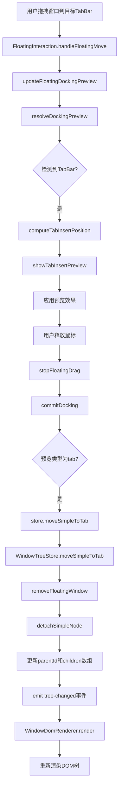

#### HTML元素/窗口树变动

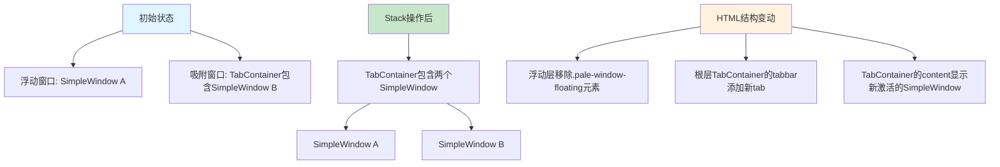

**关键函数说明：**
- `FloatingInteraction.updateFloatingDockingPreview`: 实时计算并显示 docking 预览
- `WindowTreeStore.moveSimpleToTab`: 将 SimpleWindow 移动到目标 TabContainer
- `WindowTreeStore.removeFloatingWindow`: 从浮动映射中移除窗口
- `WindowDomRenderer.render`: 响应 tree-changed 事件，重新渲染整个窗口树

---

### 2. Divide 操作（分割）

Divide 操作创建或扩展 SplitContainer，实现上下/左右分割。

#### 函数调用流程

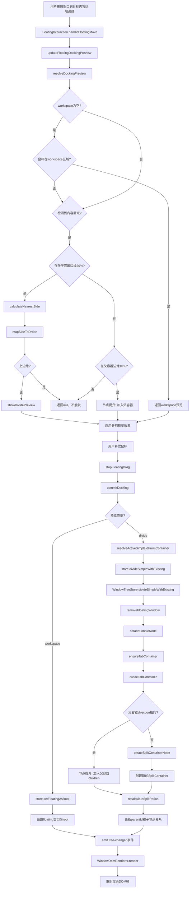

#### HTML元素/窗口树变动

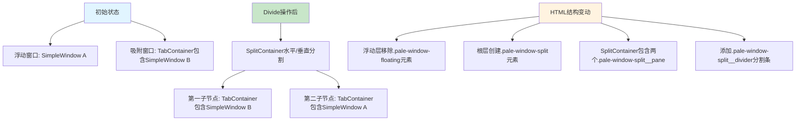

**关键函数说明：**
- `FloatingInteraction.calculateNearestSide`: 计算鼠标位置最近的分割边（上下左右）
- `FloatingInteraction.isWithinDivideFloatZone`: 检测是否在叶子容器边缘 20% 区域（左、右、下边缘）
- `FloatingInteraction.isWithinParentContainerEdge`: 检测是否在父容器边缘 10% 区域（左、右、下边缘）
- `FloatingInteraction.mapSideToDivide`: 将边缘映射到分割方向和位置（上边缘返回 null，不触发任何操作）
- `FloatingInteraction.resolveDockingPreview`: 解析 docking 预览，包括空 workspace 检测
- `WindowTreeStore.divideTabContainer`: 创建 SplitContainer 或执行节点提升，重新组织窗口树
- `WindowTreeStore.createSplitContainerNode`: 创建新的分割容器节点（支持多个子节点）
- `WindowTreeStore.recalculateSplitRatios`: 重新计算分割比例（等分分布）
- `WindowTreeStore.setFloatingAsRoot`: 将浮动窗口设置为 docking 根节点（用于空 workspace docking）
- `WindowDomRenderer.renderSplit`: 渲染 SplitContainer 及其多个分割条

---

### 3. Detach 操作（分离）

Detach 操作从容器中分离窗口，转为浮动状态。

#### 函数调用流程

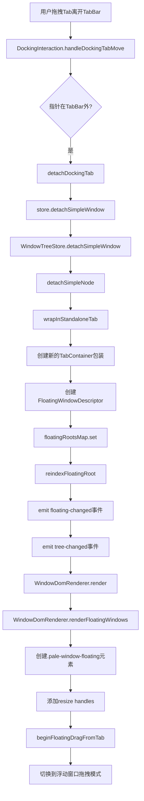

#### HTML元素/窗口树变动

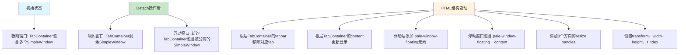

**关键函数说明：**
- `WindowTreeStore.detachSimpleWindow`: 从树中分离窗口并创建浮动描述符
- `WindowTreeStore.wrapInStandaloneTab`: 将 SimpleWindow 包装为独立的 TabContainer
- `WindowTreeStore.reindexFloatingRoot`: 更新浮动窗口索引映射
- `WindowDomRenderer.renderFloatingWindows`: 渲染所有浮动窗口到浮动层

---

### 4. 拖动 Tab（Tab重排）

在 TabContainer 内拖动 Tab 改变排列顺序，或拖出 TabBar 触发 Detach。

#### 函数调用流程

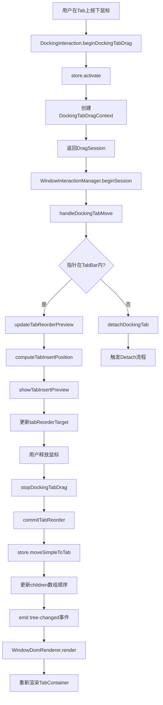

#### HTML元素/窗口树变动

```mermaid
graph TD
    A[初始状态] --> B[TabContainer: children=[A, B, C]]
    
    C[Tab重排后] --> D[TabContainer: children=[A, C, B]]
    
    E[HTML结构变动] --> F[tabbar中tab元素顺序改变]
    E --> G[显示.pale-window-tab-insert-preview插入预览]
    E --> H[tab元素DOM顺序更新]
    E --> I[activeChildId保持不变]
    
    J[拖出TabBar] --> K[触发Detach操作]
    
    style A fill:#e1f5ff
    style C fill:#c8e6c9
    style E fill:#fff3e0
    style J fill:#ffcdd2
```

**关键函数说明：**
- `DockingInteraction.computeTabInsertPosition`: 根据鼠标位置计算 tab 插入索引
- `WindowTreeStore.moveSimpleToTab`: 在同一个容器内移动时，只更新 children 数组顺序
- `WindowDomRenderer.renderTabContainer`: 根据 children 顺序渲染 tab 元素

---

### 5. 拖动 TabBar（浮动窗口移动）

拖动浮动窗口的 TabBar 空白区域，移动整个浮动窗口。

#### 函数调用流程

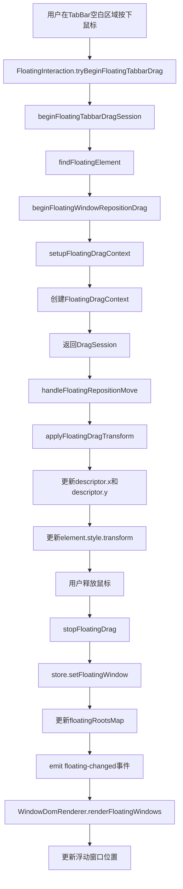

#### HTML元素/窗口树变动

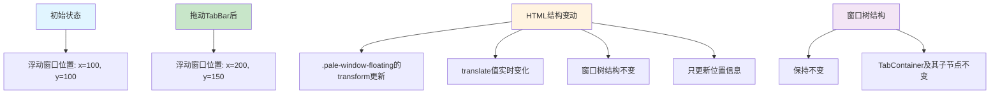

**关键函数说明：**
- `FloatingInteraction.beginFloatingWindowRepositionDrag`: 开始浮动窗口位置拖拽
- `FloatingInteraction.applyFloatingDragTransform`: 实时更新浮动窗口的 transform 样式
- `WindowTreeStore.setFloatingWindow`: 保存浮动窗口的最新位置和尺寸
- `WindowDomRenderer.renderFloatingWindows`: 根据描述符重新渲染浮动窗口位置

---

### 6. 拖动 Split Divider（调整分割比例）

拖动 SplitContainer 的分割条，调整两个子节点的尺寸比例。

#### 函数调用流程

```mermaid
graph TD
    A[用户在分割条上按下鼠标] --> B[DockingInteraction.beginDividerDrag]
    B --> C[识别dividerIndex]
    C --> D[创建DividerDragContext]
    D --> E[返回DragSession]
    E --> F[handleDividerMove]
    F --> G{方向为horizontal?}
    G -->|是| H[计算水平比例: event.clientX / width]
    G -->|否| I[计算垂直比例: event.clientY / height]
    H --> J[clamp比例基于相邻divider]
    I --> J
    J --> K[更新previewRatio]
    K --> L[计算所有pane的flex值]
    L --> M[更新所有pane.style.flex]
    M --> N[用户释放鼠标]
    N --> O[stopDividerDrag]
    O --> P[store.updateSplitRatio]
    P --> Q[WindowTreeStore.updateSplitRatio]
    Q --> R[更新ratios[dividerIndex]]
    R --> S[emit tree-changed事件]
    S --> T[WindowDomRenderer.render]
    T --> U[重新渲染SplitContainer]
```

#### HTML元素/窗口树变动

```mermaid
graph TD
    A[初始状态] --> B[SplitContainer: ratios=[0.33, 0.67]]
    B --> C[三个子节点: flex分别为0.33, 0.34, 0.33]
    
    D[拖动Divider 0后] --> E[SplitContainer: ratios=[0.5, 0.67]]
    E --> F[三个子节点: flex分别为0.5, 0.17, 0.33]
    
    G[HTML结构变动] --> H[所有.pale-window-split__pane的flex值更新]
    G --> I[分割条位置视觉上移动]
    G --> J[窗口树节点结构不变]
    G --> K[只更新ratios数组]
    
    style A fill:#e1f5ff
    style D fill:#c8e6c9
    style G fill:#fff3e0
```

**关键函数说明：**
- `DockingInteraction.beginDividerDrag`: 识别 divider 索引，创建拖拽上下文
- `DockingInteraction.handleDividerMove`: 实时计算并应用分割比例，更新所有 pane 的 flex 值
- `WindowTreeStore.updateSplitRatio`: 更新 SplitContainer 节点指定索引的比例（ratios[dividerIndex]）
- `WindowDomRenderer.createSplitPane`: 根据 ratios 数组计算每个 pane 的 flex 样式

---

### 7. 浮动窗口 Resize（调整大小）

拖动浮动窗口的 resize handle，调整窗口尺寸。

#### 函数调用流程

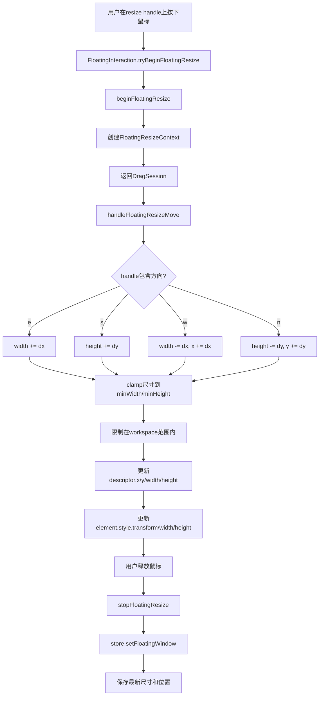

#### HTML元素/窗口树变动

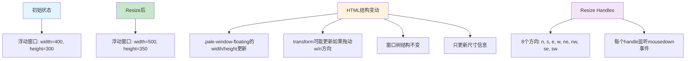

**关键函数说明：**
- `FloatingInteraction.handleFloatingResizeMove`: 根据 handle 方向计算新尺寸
- `WindowTreeStore.setFloatingWindow`: 保存调整后的尺寸和位置
- `WindowDomRenderer.appendFloatingResizeHandles`: 为浮动窗口添加 8 个方向的 resize handles